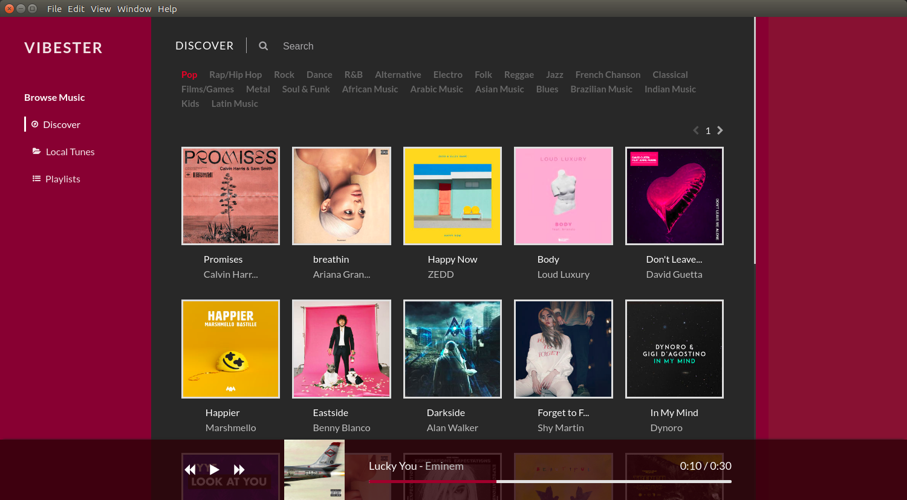

Vibester is a simple and elegent music player powered by Electron and VueJs

### Installation

`yarn install (or npm install)`

#### Dev

`yarn serve:elecron`

#### Build

`yarn build:elecron`

If you wish you contribute to this project, this road map below that should give you a fair idea on what im planning to implement next:

- Playlists
- Shuffle, loop
- Other audio formats support
- Alternative theme maybe!
- speed control

This is what i have in mind at the moment but any ideas and suggestions are very welcome.

